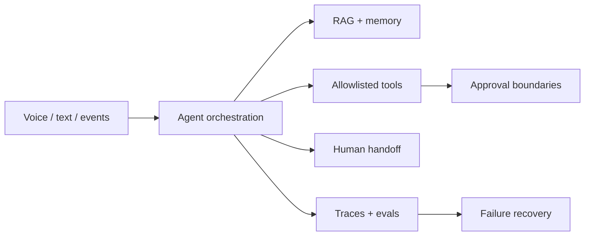

# Ahmed Saad — Enterprise Agent Engineer

I build production-minded AI-agent systems: tool orchestration, retrieval, approval gates, multilingual and voice workflows, deterministic replay, evaluations, observability, and secure enterprise integration.

My public portfolio uses synthetic data and offline mock modes so every result can be reproduced without customer access or paid model credentials.

## Featured engineering work

| Project | What it proves | Reproducible evidence |
|---|---|---|
| [Agentic RAG Platform](https://github.com/AbuElNour/agentic-rag-platform-reference) | Multi-agent routing, grounded retrieval, trust gates, tenant memory | 20 tasks × 3 trials; retrieval, routing, injection, approval, and isolation gates |
| [AuraCRM](https://github.com/AbuElNour/AuraCRM) | Tenant-safe CRM swarm, MCP-style tool policy, PII redaction, recovery | 20 tasks × 3 trials; tenant, masking, allowlist, and handoff tests |
| [Multimodal Executive Agent](https://github.com/AbuElNour/ministerial-evenrealities-poc) | Smart-glasses workflow, streaming bridge, bilingual minutes, replay | 61 tests; 20 tasks × 3 trials; 3/3 replay commitments and 0 false positives |
| [Meeting Intelligence](https://github.com/AbuElNour/agentforce-meeting-intelligence) | Decision/action extraction, hallucination controls, idempotency, Agentforce boundary | 20 tasks × 3 trials plus Apex and metadata validation |
| [Railway Booking Platform](https://github.com/AbuElNour/agentic-railway-booking-platform) | Confirmed state transitions, API contracts, failure compensation, Agentforce/Mule boundary | 20 tasks × 3 trials; deterministic safety and rollback scenarios |

## Agent engineering map

## Focused references

- [Mistral Voice Agent Gateway](https://github.com/AbuElNour/mistral-voice-agent-gateway) — streaming, interruption, retry, and duplicate-event handling.
- [Multilingual Agentic Contact Center](https://github.com/AbuElNour/multilingual-agentic-contact-center) — Arabic/English routing, document gates, and escalation.
- [Agentic AI Workstation Blueprint](https://github.com/AbuElNour/agentic-ai-workstation-blueprint) — reproducible model-serving topology, health routing, failover, and IaC validation.
- [Agentforce Voice Channel Reference](https://github.com/AbuElNour/agentforce-voice-channel-reference) — signed webhooks, idempotency, voice fallback, and channel isolation.
- [Mistral Tax Agent](https://github.com/AbuElNour/mistral-tax-agent) — citation-first retrieval, refusals, and confirmed synthetic calculations.
- [Bilingual Agentic Tax Advisor](https://github.com/AbuElNour/bilingual-agentic-tax-advisor) — clean-room bilingual guidance, privacy filtering, mock e-invoice tools, and human handoff.

Every listed repository documents what I built, what is mocked, known limitations, provenance, security boundaries, and the exact offline evaluation report.

