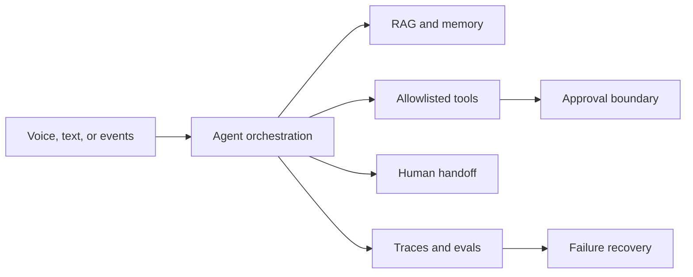

# Applied AI Engineer | Enterprise AI Solutions Architect

I build reliable agentic systems that combine RAG, tool use, approval boundaries, multilingual and voice workflows, evaluations, observability, and enterprise integration. My public work is intentionally runnable with synthetic data and credential-free mock modes, so an engineer can inspect the implementation and reproduce the evidence without customer access.

[LinkedIn](https://www.linkedin.com/in/abuelnour) · [Recruiter-safe résumé](assets/Ahmed_Saad_Applied_AI_Resume.pdf) · [All public repositories](https://github.com/AbuElNour?tab=repositories)

## Featured engineering work

| Project | Engineering signal | Reproducible evidence |
|---|---|---|
| [Agentic RAG Platform](https://github.com/AbuElNour/agentic-rag-platform-reference) | Tenant-scoped retrieval, grounded citations, tool routing, and approval gates | 20 deterministic tasks × 3 trials; 100% isolation and approval gate |
| [Multimodal Executive Agent](https://github.com/AbuElNour/ministerial-evenrealities-poc) | Typed smart-glasses events, bilingual minutes, bridge recovery, deterministic replay | 61 tests; 3/3 replay commitments; 0 false positives |
| [Mistral Voice Agent Gateway](https://github.com/AbuElNour/mistral-voice-agent-gateway) | Bilingual streaming state, barge-in, replay protection, and bounded retries | 20 deterministic orchestration scenarios × 3 trials |
| [Multilingual Agentic Contact Center](https://github.com/AbuElNour/multilingual-agentic-contact-center) | Arabic/English intent routing, document gates, approval, and escalation | 10 deterministic scenarios × 3 trials |
| [AuraCRM](https://github.com/AbuElNour/AuraCRM) | Four-agent workflow, MCP-style allowlists, PII controls, and tenant isolation | 20 deterministic tasks × 3 trials; 100% safety gate |

**Evidence legend:** deterministic regression results are generated offline by code-based graders and run in pull-request CI. Provider-backed OpenAI/Mistral evaluations are a separate, opt-in local suite; no comparative model claim is published until both providers complete the same tasks and pass the documented release gates.

## How I engineer agents

My repositories make the trust boundary visible: inputs, routing decisions, tool events, approvals, state transitions, errors, and final outcomes are testable. They do not retain hidden model reasoning, customer data, production credentials, or private infrastructure details.

## Additional engineering references

- [Agentic AI Workstation Blueprint](https://github.com/AbuElNour/agentic-ai-workstation-blueprint) — reproducible local model-serving topology, health routing, failover, and IaC validation.
- [Agentic Railway Booking Platform](https://github.com/AbuElNour/agentic-railway-booking-platform) — confirmed booking state transitions, API contracts, payment failure, and compensation.
- [Agentforce Meeting Intelligence](https://github.com/AbuElNour/agentforce-meeting-intelligence) — action/decision extraction, hallucination controls, idempotency, Apex, and metadata validation.
- [Agentforce Voice Channel Reference](https://github.com/AbuElNour/agentforce-voice-channel-reference) — signed webhooks, idempotency, provider fallback, and channel isolation.
- [Mistral Tax Agent](https://github.com/AbuElNour/mistral-tax-agent) — citation-first retrieval, unsupported-advice refusal, and synthetic calculations.
- [Bilingual Agentic Tax Advisor](https://github.com/AbuElNour/bilingual-agentic-tax-advisor) — clean-room bilingual guidance, privacy filtering, mock e-invoice tools, and human handoff.

## Portfolio boundaries

Every project documents what I built, what is mocked, known limitations, provenance, security boundaries, and the exact offline evaluation report. The public portfolio contains clean-history reference implementations and synthetic demonstrations; private enterprise source histories remain private.
